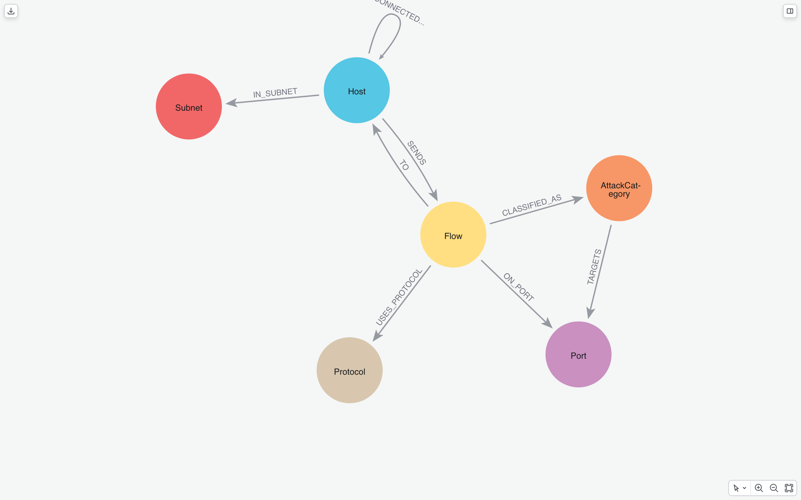
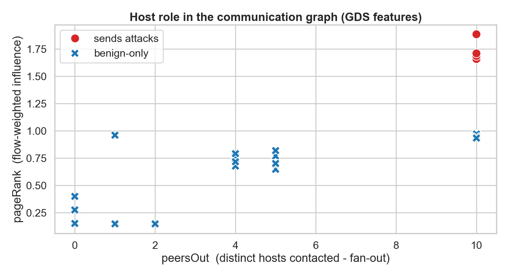
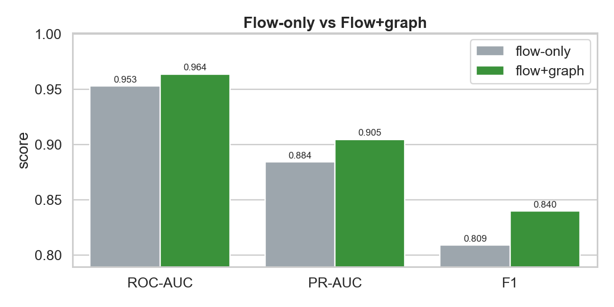
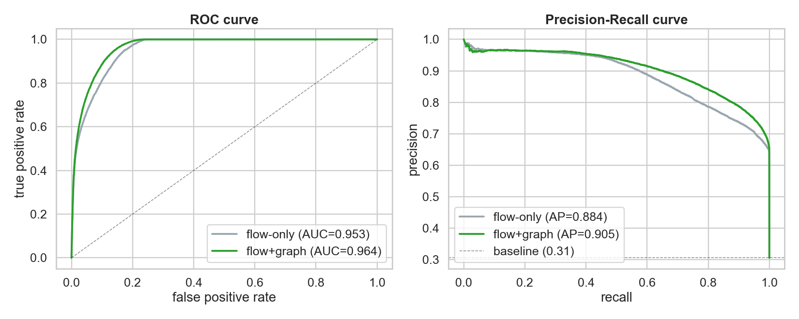
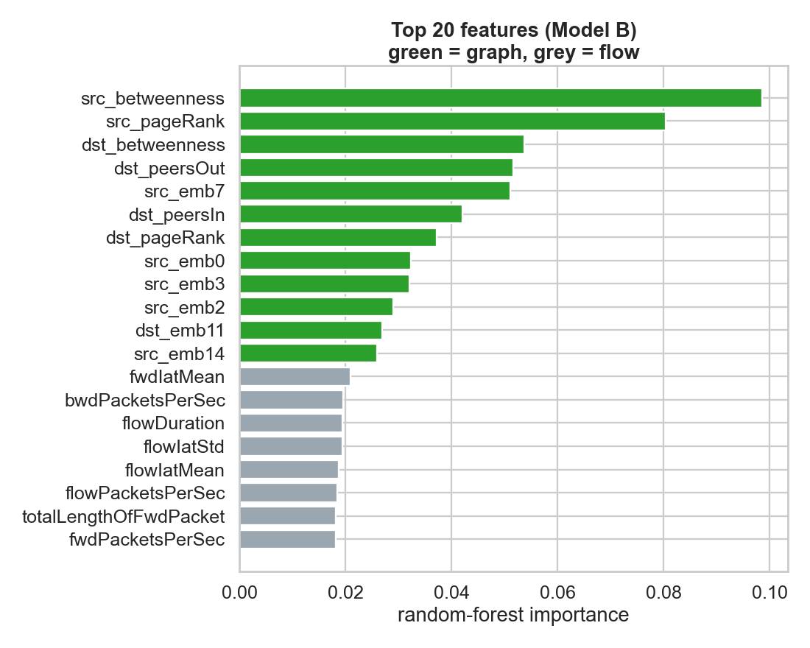
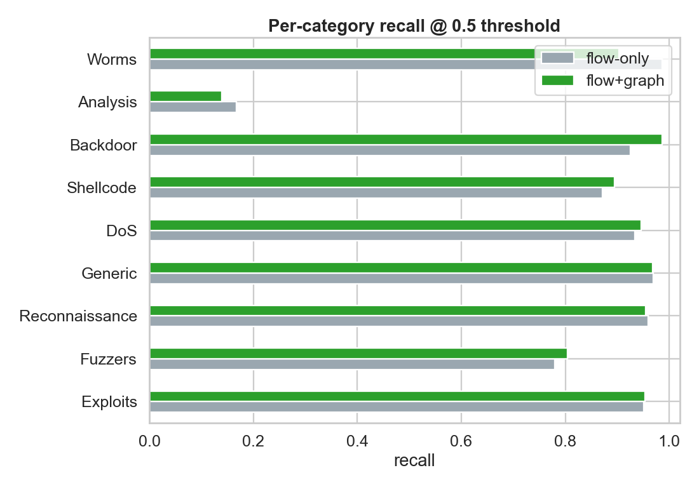

# A Network Graph Analysis of the CIC-UNSW-NB15 Dataset using Neo4j and Graph Data Science (GDS)

This notebook demonstrates possible applications in network security analysis using Neo4j and its Graph Data Science (GDS) library. It uses the [CIC-UNSW-NB15](https://www.unb.ca/cic/datasets/cic-unsw-nb15.html) dataset, which contains a rich set of network flow records labeled with various attack types and normal traffic. The dataset is ideal for exploring how graph-based techniques can enhance our understanding of network behavior and improve threat detection.

This presents typical patterns and techniques for analyzing network flow data, suitable for identifying anomalies, understanding communication patterns, and extracting insights from network traffic data captured by network monitoring tools such as [Zeek](https://zeek.org/), [Suricata](https://suricata.io/), [Argus](https://qosient.com/argus/), or [Wireshark](https://www.wireshark.org/).

<p align="center">
  
  <br>
  <sub>The schema of the CIC-UNSW-NB15 dataset represented as a graph.</sub>
</p>

## Key objectives

Amongst others, in this notebook, we will execute a complete Graph Data Science workflow tailored for security analysts to:

- Understand how networks and network traffic can be represented as graphs, and the types of insights that can be derived from such representations.
- Graph Modeling: Map the raw tabular data of the CIC-UNSW-NB15 dataset into a highly optimized graph schema.
- In-Memory Projections: Create high-performance graph projections suitable for cloud-ephemeral managed environments (like Neo4j AuraDS).
- Representation Learning (FastRP): Generate low-dimensional, topology-aware node embeddings that capture the unique structural footprint of every host.
- Behavioral Similarity (KNN & Cosine Similarity): Identify hidden, look-alike malicious actors by streaming similarity metrics against known indicators of compromise (IoCs).
- Sub-graph Visualization: Extract and render structural paths (CONNECTED_TO, IN_SUBNET) to visually compare the blast radiuses of suspicious network nodes.

## Using this notebook

Start by creating a `.env` file in the root of this project with the following content, replacing the placeholders with your actual Neo4j connection details:

```env
NEO4J_URI=bolt://localhost:7687
NEO4J_USER=neo4j
NEO4J_PASSWORD=your_password
NEO4J_DATABASE=neo4j
RENDER_DIR=renderings
DATASET_PATH=.data/CIC-UNSW/CICFlowMeter_out.csv
```

You should also download the [CIC-UNSW-NB15](https://www.unb.ca/cic/datasets/cic-unsw-nb15.html) dataset and place its content in `.data/CIC-UNSW/`. The `CICFlowMeter_out.csv` file contains the processed flow records that we will ingest into Neo4j.

Configure your Python environment with the required dependencies (`conda env update` if you are using the provided `environment.yml`), and then run [`loader.ipynb`](./loader.ipynb) to ingest the dataset into Neo4j. After the data is loaded, the notebooks are designed to be read in the following order:

1. [`analysis.ipynb`](./analysis.ipynb) — exploratory data analysis and graph visualizations.
2. [`gds.ipynb`](./gds.ipynb) — Graph Data Science algorithms (FastRP embeddings, KNN similarity against known IoCs).
3. [`baseline.ipynb`](./baseline.ipynb) — a transparent, label-free statistical baseline (per-feature robust Z-scores) for anomaly detection.
4. [`ml-gds.ipynb`](./ml-gds.ipynb) — a supervised classifier that measures whether graph-derived features actually improve detection over per-flow statistics alone.

## Results: does the graph help?

The project attacks malicious-traffic detection three ways, each with different requirements:

| Notebook | Approach | Needs labels? | Needs a trained model? |
|----------|----------|:-------------:|:----------------------:|
| [`baseline.ipynb`](./baseline.ipynb) | Statistical baselining — per-feature robust Z-scores over `(protocol, port, hour, day)` groups | No | No |
| [`gds.ipynb`](./gds.ipynb) | Unsupervised graph similarity — FastRP embeddings + KNN against known IoCs | No | No |
| [`ml-gds.ipynb`](./ml-gds.ipynb) | Supervised ML — a classifier trained on labelled flows | Yes (at train time) | Yes |

### The statistical baseline ([`baseline.ipynb`](./baseline.ipynb))

The baseline scores each flow in isolation against a benign profile, with no model and no labels at inference time. Evaluated against a 50k-flow sample of known-malicious traffic at a 3-sigma threshold, it catches **53.8%** of malicious flows (26,886 / 50,000) and surfaces 3,476 louder-than-usual subnet/port volume windows. Crucially, every alert is **explainable** — it points at a specific feature (`flowIatMean`, `flowIatStd`, `flowDuration` and `packetLengthMean` do most of the work), a specific group key, and a numeric Z-score.

Its weakness is structural blindness: scoring flows one at a time, it has no notion of *who is talking to whom*. Detection is uneven across attack families, and the stealthy, low-volume families (`Worms`, `Analysis`, `Backdoor`) are the hardest for it to catch.

### Does the graph make ML better? ([`ml-gds.ipynb`](./ml-gds.ipynb))

This notebook isolates a single question: **do graph-derived features improve a supervised classifier, or are the per-flow statistics enough on their own?** It trains the *same* `RandomForestClassifier` twice on the *same* 70/30 split of 293,501 flows (30.5% malicious), changing only the feature set:

- **Model A — flow-only:** the 28 per-flow CICFlowMeter statistics (duration, byte/packet rates, IAT timing, packet-size profile, TCP flags).
- **Model B — flow + graph:** the identical flow statistics **plus** 40 structural features (degree, PageRank, betweenness, and a 16-dim FastRP embedding) describing each endpoint's role in the `(:Host)-[:CONNECTED_TO]->(:Host)` communication graph, computed with Neo4j GDS and attached to both the source and destination host of every flow.

The intuition is visible even before any flow statistics are involved: plotting fan-out (`peersOut`) against flow-weighted `pageRank` already separates the attacker hosts from the benign population.

<p align="center">
  
  <br>
  <sub>GDS structural features alone separate the attacker hosts (red) from benign hosts (blue). Colour is illustrative only — it is not a model feature.</sub>
</p>

Adding the graph features moves every metric in the right direction:

| Model | Features | ROC-AUC | PR-AUC | F1 (malicious) | Malicious precision | Malicious recall |
|-------|:--------:|:-------:|:------:|:--------------:|:-------------------:|:----------------:|
| Flow-only | 28 | 0.9528 | 0.8841 | 0.8092 | 0.741 | 0.891 |
| **Flow + graph** | 68 | **0.9638** | **0.9047** | **0.8400** | **0.787** | **0.900** |

<p align="center">
  
  <br>
  <sub>Adding GDS structural features lifts ROC-AUC, PR-AUC and F1.</sub>
</p>

The separation is clearest in the precision-recall curve, where the flow+graph model holds higher precision across the high-recall region:

<p align="center">
  
  <br>
  <sub>ROC (left) and Precision-Recall (right) curves on the held-out test set. The PR baseline (0.31) is the malicious prevalence.</sub>
</p>

PR-AUC — the honest metric under class imbalance — rises by **+0.0206**, and the random forest leans on the structural features heavily: they carry **68.2%** of total feature importance (40 of 68 features). The graph features are not dead weight — they take the top spots in the importance ranking, ahead of every per-flow statistic.

<p align="center">
  
  <br>
  <sub>Top 20 random-forest importances in Model B. Graph features (green) such as <code>src_betweenness</code> and <code>src_pageRank</code> dominate over the per-flow statistics (grey).</sub>
</p>

**It isn't host-identity leakage.** The structural features are built only from label-free topology and volume — the label-derived `attackFlows` edge weight is explicitly excluded from the GDS projection. The notebook's honest stress test scores only the 43,869 attacker-host flows, the subset where the "this endpoint looks like an attacker" prior is constant and useless. There the two models **converge** (flow-only PR-AUC 0.887 vs flow+graph 0.905), confirming the graph supplies a legitimate *prior* on the easy traffic while the flow statistics do the hard within-host discrimination — rather than simply memorising which IPs attack.

**Where the graph helps most** is precisely the stealthy families the statistical baseline struggles with: per-category recall improves for `Backdoor` (0.925 → 0.986), `Shellcode` (0.871 → 0.895), `Fuzzers` (0.780 → 0.804) and `DoS` (0.933 → 0.946).

<p align="center">
  
  <br>
  <sub>Per-attack-family recall at the 0.5 threshold. The graph lifts the stealthy families (<code>Backdoor</code>, <code>Shellcode</code>, <code>Fuzzers</code>); <code>Analysis</code> stays hard for both, and <code>Worms</code> dips slightly.</sub>
</p>

### Bottom line

The three approaches are **complementary, not competing**:

- **`baseline.ipynb`** needs no labels and is fully explainable, but is blind to graph structure — best as a transparent first line of defence for loud-and-weird outliers.
- **`gds.ipynb`** uses the same FastRP embeddings *unsupervised*, to find look-alike hosts near a known IoC.
- **`ml-gds.ipynb`** closes the loop: when labels exist, graph features are a cheap, high-value addition to a supervised model. **The graph is a feature store, not just a query engine.**

A few caveats are worth keeping in mind: the benign down-sampling makes the class ratio friendlier than production's ~2.5% malicious (prefer PR-AUC over accuracy); the graph features here are static over the whole capture window (in production they would be recomputed on a rolling window); and with only ~40 hosts the structural feature space is small — the approach pays off far more on enterprise-scale graphs with thousands of endpoints.